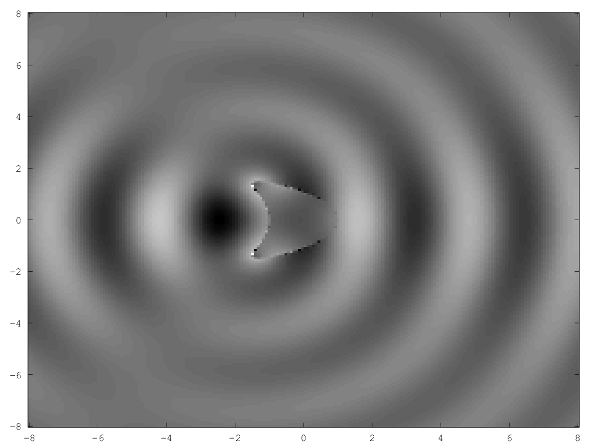

# Basic-2D-Helmholtz-Solver
A MATLAB implementation of a 2D Helmholtz solver based on the algorithms in "Inverse Acoustic and 
Electromagnetic Scattering Theory" by Colton and Kress. See demo_dos.m for examples of how to use.
Below are some plots generated using the code.

